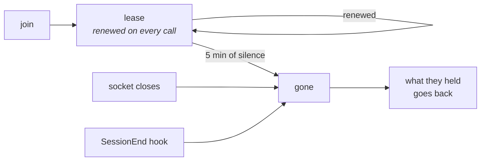

# Presence

Presence answers "who is here, and how quickly will they notice anything I
say." `parley who` lists every live participant with their claims and how
long they have been idle (`src/state/participants.ts:289-298`). Underneath
that is one honest complication: two kinds of client exist, with opposite
lifetimes. A persistent connection — an MCP server process, or the panel —
lives as long as the session does, so for it connection *is* presence.
An ephemeral hook connects, sends one frame, and exits, several times a
minute; presence for it cannot depend on staying connected, because staying
is the one thing it never does. So it gets a **lease with a TTL, renewed by
every call**: a participant counts as alive if it holds an open connection
or has been seen within the lease window
(`docs/ARCHITECTURE.md:161-177`, `src/state/machine.ts:297-312`,
`DEFAULTS.LEASE_TTL_MS` at `src/protocol/types.ts:69`). Each participant also
reports a `delivery` mode — `live`, `hooks`, or `manual` — and a
plain-language `reach` describing when a message to them will actually be
seen: immediately for a live connection, "on its next tool call" for a hook
(with a note if it has been idle over two minutes), or "only when someone
runs parley there" for a shell-only front with no hook at all
(`src/state/types.ts:357-392`).

Three ways to leave, and only one of them is polite. The lease exists because
the other two are what actually happens: a laptop closes, a process is killed,
a window is shut. Presence that depends on saying goodbye is presence that
lies.

## Why it is built this way

The alternative — presence as nothing but an open socket — does not fit the
client that fires a hook, sends one frame, and exits before the daemon could
ever notice it was there. Deciding presence by connection alone would mean a
front doing exactly what it is supposed to do, editing files between tool
calls, reads as *gone* in between every single one of them. So parley
accepts a different, plainly-stated cost instead:

> A front that stopped renewing its lease is gone. A live connection is
> proof on its own, so only lease-only participants can expire this way.
> (`src/state/machine.ts:297-298`)

A false "gone" would cost a working front its territory and its inbox on
every idle moment between tool calls — the case that happens constantly. A
false "alive" costs up to one lease window, five minutes by default, of
addressing a front that already exited before anyone notices. parley takes
the second cost, because the first would make the ephemeral client — the
one actually running most sessions — permanently look dead.

## What happens when it fails

A front that stops renewing is not declared dead the instant its socket
closes: dropping a connection only clears `connected` and falls back to the
lease, because a dropped connection is not proof of death for a front that
also renews through the CLI (`src/daemon/server.ts:829-839`). Once the lease
genuinely lapses, the participant is marked `gone`, its claims are stamped
`orphaned` immediately, and the bus announces it by name — *"FINANCEIRO
dropped holding 3 claim(s)"* — before releasing them after the grace period
(`src/state/machine.ts:260-275`).

A daemon restart clears presence entirely rather than trusting what the
journal remembers: replay rebuilds every participant, and then every one of
them is explicitly set to not connected — "nothing survives a restart
connected; presence has to be re-proven" (`src/daemon/server.ts:637-652`,
specifically line 111). A front that held an open connection before the
restart looks exactly like a hook-only front until it calls in again, which
is the safe direction to be wrong in.
