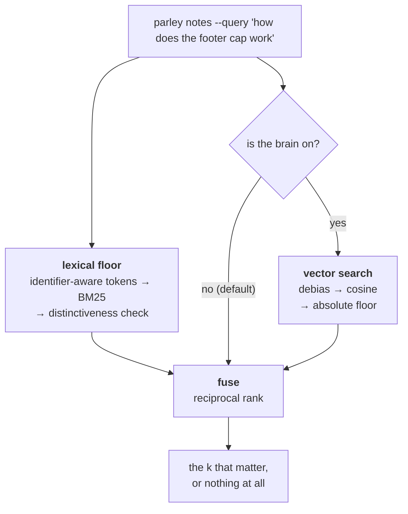
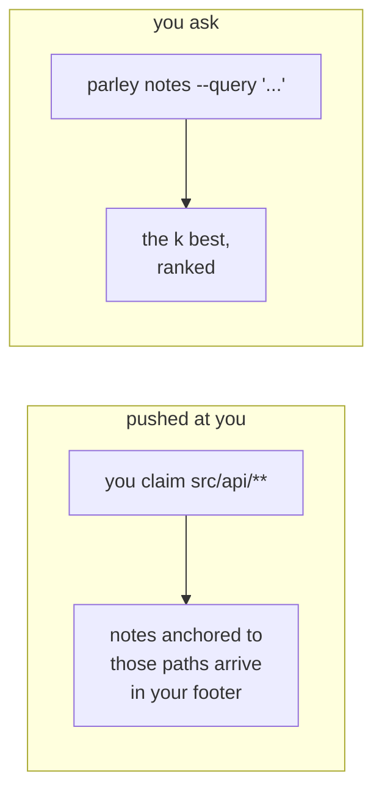
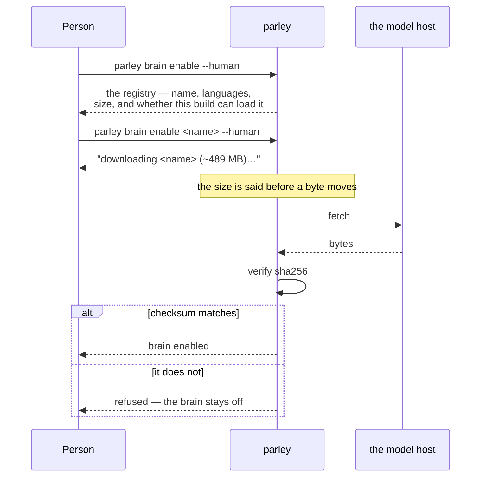
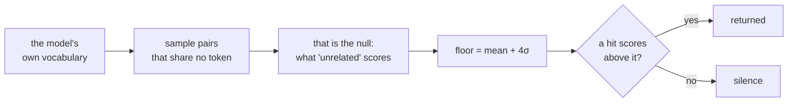

# Notes and recall

Recall has two layers, and only one of them is ever guaranteed to be there.

> The floor. Always present, deterministic, no model, no download. It is not
> a consolation prize: it is what answers while the brain is off, what
> answers if the model is missing, and what a fresh install has on day one.
> The brain is strictly additive on top of this.
> (`src/brain/lexical.ts:23-29`)

Both layers exist. The floor is always on; the brain is opt-in, off until a
person turns it on and chooses a model.



The brain is **strictly additive**. Remove it and every query still answers —
that is the property the whole design is arranged around, and it is why the
floor is described first here.

## Two ways a note reaches you

Anchored notes arrive without anyone asking; queried notes are pulled. They are
different channels and it is worth knowing which is which.



The first costs you nothing and needs no query: someone left a note anchored to
a path, and you claimed that path. The second is for the question that has no
single path to anchor on.

## The floor: tokens, then BM25, then a distinctiveness check

Text going into the index is split by an identifier-aware tokeniser, not a
plain word splitter. The corpus is notes about code — file names, CSS
classes, function calls — so a compound like `is_staff()` is kept whole
*and* split into its parts, and a `camelCase` boundary is split the same way
snake_case and dashes are, so both `is_staff` and `staff` find the same note
(`src/brain/tokenize.ts:1-27`).

Scoring is BM25 (`K1 = 1.2`, `B = 0.75`), computed per term as inverse
document frequency times a term-frequency curve normalised against average
document length (`src/brain/lexical.ts:10-11,84-89`). On top of that sits one
extra rule: a hit only counts if at least one of its matched terms is not
shared by more than half the corpus.

> A hit qualifies only if it matched a term that does not appear in a
> majority of the corpus. IDF already pushes ubiquitous terms toward zero,
> but never all the way there, so without this a note sharing only a common
> word with the query would still outrank returning nothing — and returning
> the least-bad note is worse than silence (spec §6).
> (`src/brain/lexical.ts:70-75`)

That check only switches on once the corpus holds at least four documents
(`MIN_DOCS_FOR_THRESHOLD`, `src/brain/lexical.ts:14-19`) — below that, "half
the corpus" is one or two notes, not a real signal. Reversed decisions never
enter the index at all: `indexFromState` skips any note with a
`reversedBy`, and a live daemon removes one the moment it is reversed, so a
reversed decision cannot surface as a recall hit even between rebuilds
(`src/brain/lexical.ts:107-118`; `src/daemon/server.ts:795-797`).

## Reaching it: `parley notes --query`

```
parley notes --query "select2 initialisation" --k 8
```

The query never reaches the pure state machine directly. `listNotes` itself
never reads `q` — it cannot, by design:

> The daemon resolves `q` into ranked `ids` before calling `apply` — this
> module has no clock and no I/O, so it cannot search on its own.
> (`src/state/notes.ts:100-101`)

The daemon does the ranking, on its own in-memory copy of the index, before
the frame ever reaches `apply` — and only that copy is touched; the journal
keeps exactly the frame that came in over the wire, so a replay never has to
agree with what the index looked like at write time
(`src/daemon/server.ts:673-676`). It searches across the *whole* corpus —
notes, decisions, and results together — then filters by which op asked, and
only then slices to `k` (`src/daemon/server.ts:264-267`). The order is the
whole point:

> `search` ranks across every kind in one corpus-wide score, and its
> distinctiveness threshold is a property of the whole corpus... So `k`
> cannot be handed to `search` directly: the top-k across all kinds can be
> entirely the other op's kind, which would starve this op of a real match
> it actually has.
> (`src/daemon/server.ts:680-688`)

`k` itself is bounded regardless of what is asked for — between 1 and 20,
defaulting to 5 (`src/daemon/server.ts:679`). That is the same discipline
the work pool's footer uses for offers: never hand back the corpus, only the
top of it, because that gap is exactly where the token saving comes from —
ranking and a small `k`, not a vector (`src/state/work.ts:811-818`;
`src/daemon/server.ts:253,267`).

If the index itself throws, the query does not fail — it falls back to the
same unranked list a plain `notes` call without `--query` gets
(`src/daemon/server.ts:703-707`), which is the same "never let a broken part
stop the work" shape territory and permission already follow.

## The brain: opt-in, local, and the person's call

Above the floor sits an optional embedding model. It runs locally, it is off by
default, and turning it on is a decision only a person can make:

> A download this size and a model choice spend somebody's disk and somebody's
> money, on somebody's machine, and an agent cannot answer the interactive
> prompt that decision deserves on that person's behalf.
> (`src/state/machine.ts:138-141`)

An agent that runs `parley brain enable` is refused — `OBSERVER_ONLY`, with that
sentence attached. That refusal is the *only* place in parley where a front is
turned away for being a front rather than for holding the wrong thing.

### What the person sees before anything downloads



The listing marks entries this build cannot load, rather than offering a choice
that cannot work. Downloading first and finding that out afterwards would spend
somebody's disk on an outcome that was already certain.

### How it changes a query

Once on, every ranked query runs both layers and fuses them by reciprocal rank.
What the brain buys is **paraphrase**: a Portuguese note about *"o menu
lateral"* found by an English query about *"hidden sidebar"* — no shared tokens
at all, which is exactly what the floor cannot do.

The vector side has its own floor, measured from the model rather than guessed:



A fixed threshold cannot work here: against dense models nearly every cosine is
positive, so *"greater than zero"* filters nothing. The floor is computed when
the model loads, from that model's own distribution — so it is right for
whichever model a person chose, and needs no per-model tuning.

### What you should do about it

Nothing, mostly. Query the same way whether it is on or off:

```bash
parley notes --query "how does the footer cap work" --k 3
```

If the brain is off and you asked for semantic recall, the bus says so once —
one high-priority notice, never repeated, so asking again cannot turn it into
noise. You still get an answer; it comes from the floor.

## What happens when it fails

The floor cannot really go down: it holds no clock and no I/O of its own,
and a broken index degrades a ranked query to the same unranked list a plain
`notes` call returns rather than failing it (`src/daemon/server.ts:703-707`).
If the daemon itself cannot be reached, `parley notes` behaves like every
other direct CLI command — it reports the problem on stderr and exits clean
rather than blocking, `parley: <reason> — continuing without coordination`
(`src/cli/main.ts:183-189`). Recall failing is never the reason an edit does
not happen; at worst, a front gets the unranked list, or the plain
path-anchored notes it would have had anyway.
