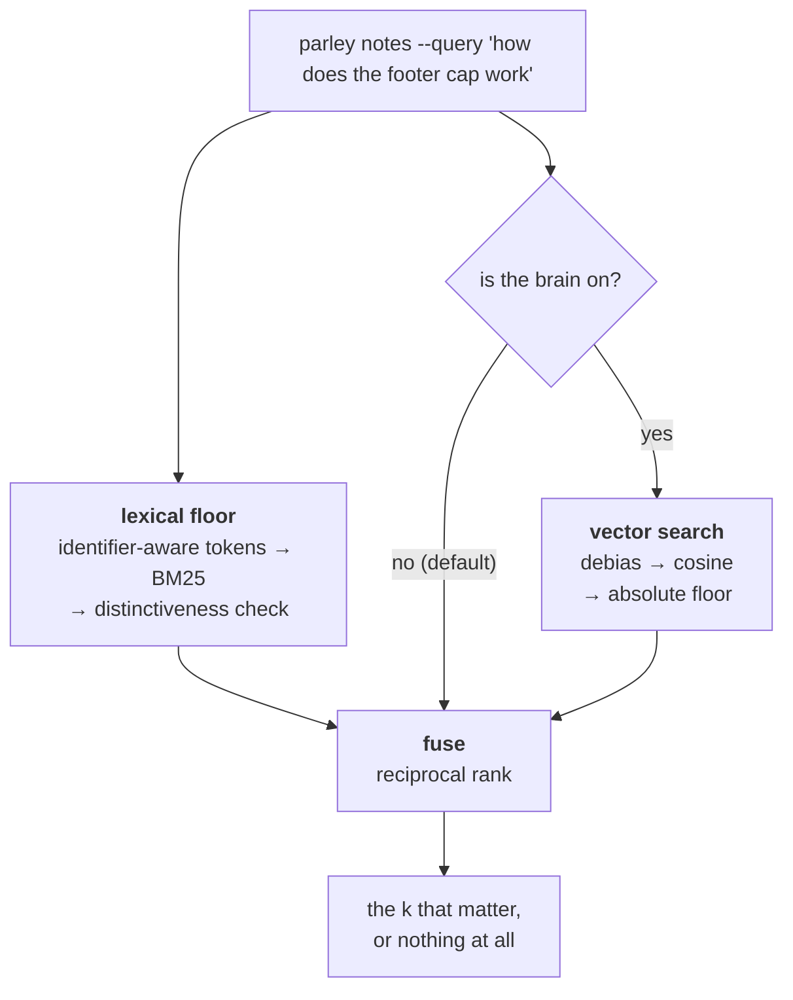
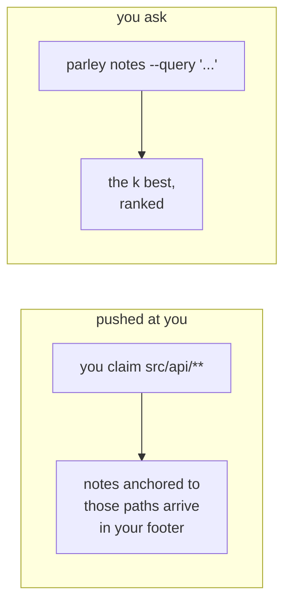
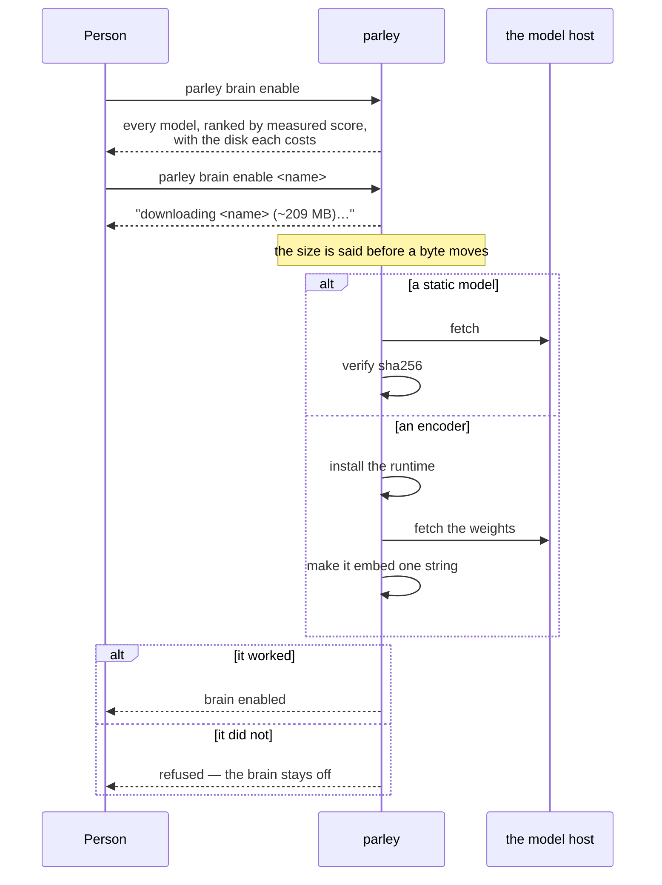
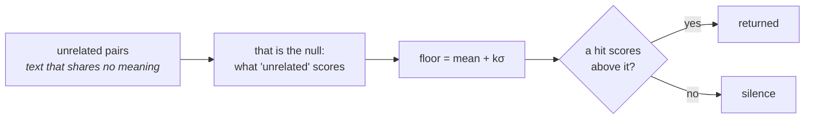

# Notes and recall

Recall has two layers, and only one of them is ever guaranteed to be there.

> The floor. Always present, deterministic, no model, no download. It is not
> a consolation prize: it is what answers while the brain is off, what
> answers if the model is missing, and what a fresh install has on day one.
> The brain is strictly additive on top of this.
> (`src/brain/lexical.ts:23-29`)

Both layers exist. The floor is always on; the brain is opt-in, off until a
person turns it on and chooses a model.



The brain is **strictly additive**. Remove it and every query still answers —
that is the property the whole design is arranged around, and it is why the
floor is described first here.

## Two ways a note reaches you

Anchored notes arrive without anyone asking; queried notes are pulled. They are
different channels and it is worth knowing which is which.



The first costs you nothing and needs no query: someone left a note anchored to
a path, and you claimed that path. The second is for the question that has no
single path to anchor on.

## The floor: tokens, then BM25, then a distinctiveness check

Text going into the index is split by an identifier-aware tokeniser, not a
plain word splitter. The corpus is notes about code — file names, CSS
classes, function calls — so a compound like `is_staff()` is kept whole
*and* split into its parts, and a `camelCase` boundary is split the same way
snake_case and dashes are, so both `is_staff` and `staff` find the same note
(`src/brain/tokenize.ts:1-27`).

Scoring is BM25 (`K1 = 1.2`, `B = 0.75`), computed per term as inverse
document frequency times a term-frequency curve normalised against average
document length (`src/brain/lexical.ts:10-11,84-89`). On top of that sits one
extra rule: a hit only counts if at least one of its matched terms is not
shared by more than half the corpus.

> A hit qualifies only if it matched a term that does not appear in a
> majority of the corpus. IDF already pushes ubiquitous terms toward zero,
> but never all the way there, so without this a note sharing only a common
> word with the query would still outrank returning nothing — and returning
> the least-bad note is worse than silence (spec §6).
> (`src/brain/lexical.ts:70-75`)

That check only switches on once the corpus holds at least four documents
(`MIN_DOCS_FOR_THRESHOLD`, `src/brain/lexical.ts:14-19`) — below that, "half
the corpus" is one or two notes, not a real signal. Reversed decisions never
enter the index at all: `indexFromState` skips any note with a
`reversedBy`, and a live daemon removes one the moment it is reversed, so a
reversed decision cannot surface as a recall hit even between rebuilds
(`src/brain/lexical.ts:107-118`; `src/daemon/server.ts:1053-1055`).

## Reaching it: `parley notes --query`

```
parley notes --query "select2 initialisation" --k 8
```

The query never reaches the pure state machine directly. `listNotes` itself
never reads `q` — it cannot, by design:

> The daemon resolves `q` into ranked `ids` before calling `apply` — this
> module has no clock and no I/O, so it cannot search on its own.
> (`src/state/notes.ts:100-101`)

The daemon does the ranking, on its own in-memory copy of the index, before
the frame ever reaches `apply` — and only that copy is touched; the journal
keeps exactly the frame that came in over the wire, so a replay never has to
agree with what the index looked like at write time
(`src/daemon/server.ts:918-921`). It searches across the *whole* corpus —
notes, decisions, and results together — then filters by which op asked, and
only then slices to `k` (`src/daemon/server.ts:350-353`). The order is the
whole point:

> `search` ranks across every kind in one corpus-wide score, and its
> distinctiveness threshold is a property of the whole corpus... So `k`
> cannot be handed to `search` directly: the top-k across all kinds can be
> entirely the other op's kind, which would starve this op of a real match
> it actually has.
> (`src/daemon/server.ts:925-933`)

`k` itself is bounded regardless of what is asked for — between 1 and 20,
defaulting to 5 (`src/daemon/server.ts:924`). That is the same discipline
the work pool's footer uses for offers: never hand back the corpus, only the
top of it, because that gap is exactly where the token saving comes from —
ranking and a small `k`, not a vector (`src/state/work.ts:811-818`;
`src/daemon/server.ts:339,267`).

If the index itself throws, the query does not fail — it falls back to the
same unranked list a plain `notes` call without `--query` gets
(`src/daemon/server.ts:950-954`), which is the same "never let a broken part
stop the work" shape territory and permission already follow.

## The brain: opt-in, local, and the person's call

Above the floor sits an optional embedding model. It runs locally, it is off by
default, and turning it on is a decision only a person makes — because it spends
their disk, on their machine.

That is enforced where it can be enforced honestly: in the CLI, from the
environment, *before* anything downloads. A harness stamps its session id into
the environment and a person's shell does not, so `parley brain enable` looks
for `CLAUDE_CODE_SESSION_ID` and its equivalents and refuses when it finds one.
A person whose terminal trips that check says `--human` and carries on.

It is deliberately not a check on who you are on the bus. An earlier version
gated the reducer on participant kind, which meant a person had to *join* to
spend their own disk — and joining put them in the fronts' namespace, competing
for a branch-derived name with the agent already working on that branch. The
gate cost the person their identity to enforce something the environment
already knew.

### The two kinds of model

The registry holds both, and they differ in one thing that matters to a person:
whether anything has to be installed.

| | how it runs | needs |
|---|---|---|
| **static** | a token lookup table, inside the binary | nothing |
| **encoder** | a real transformer, in its own process | `bun`, installed once |

An encoder cannot live inside the single compiled binary: it needs
`onnxruntime`, which is a native addon, and a native addon is the one thing
`bun build --compile` cannot swallow. So it lives beside the binary as a
sidecar the daemon talks to over NDJSON — the same shape the bus itself speaks
— and `brain enable` installs it for you.

That is the whole cost, and it buys a large difference. Measured on twenty
questions written to share as few words as possible with the note that answers
them, run through the real bus: the lexical floor alone answers 5, and the
recommended encoder answers 14. In Portuguese specifically, 2 against 8.

### What the person sees before anything downloads



The listing's only claim about a model is its score, and the score is not how
often the model ranked the right note first — it is how often the right note
came back *as the answer*, having also cleared the model's own relevance floor.
The distinction is not academic. The recommended model ranks correctly 18 times
in 20; against a floor set the way the static models set theirs, one of those 18
survived. A listing advertising 18 would have been advertising silence.

That last step in the encoder branch is there for the same reason. An earlier
draft trusted the exit code, and the worker exits cleanly when its input closes
whether or not it ever loaded anything — so a model that never downloaded
reported a successful install. Only the worker saying `ready`, with a vector
width, proves it: saying that takes a forward pass.

### How it changes a query

Once on, every ranked query runs both layers and fuses them by reciprocal rank.
What the brain buys is **paraphrase**: a Portuguese note about *"o menu
lateral"* found by an English query about *"hidden sidebar"* — no shared tokens
at all, which is exactly what the floor cannot do.

The vector side has its own floor, measured rather than guessed — a fixed
threshold cannot work here, because against dense models nearly every cosine is
positive and *"greater than zero"* filters nothing.



Where the null comes from is the one place the two kinds differ. A static model
carries its own vocabulary, so the daemon samples it at load time and computes
the floor for whichever model was chosen. An encoder has no table to sample —
only a function you would have to run thousands of times — so its floor is
measured once, offline, and shipped in the registry beside the model.

The multiplier is measured too, not inherited. Four sigma is right for a static
table and silences an encoder almost completely; the shipped encoder uses two,
which is where a sweep put the knee between keeping true matches and letting
unrelated text through.

### What you should do about it

Nothing, mostly. Query the same way whether it is on or off:

```bash
parley notes --query "how does the footer cap work" --k 3
```

If the brain is off and you asked for semantic recall, the bus says so once —
one high-priority notice, never repeated, so asking again cannot turn it into
noise. You still get an answer; it comes from the floor.

## What happens when it fails

The floor cannot really go down: it holds no clock and no I/O of its own,
and a broken index degrades a ranked query to the same unranked list a plain
`notes` call returns rather than failing it (`src/daemon/server.ts:950-954`).
If the daemon itself cannot be reached, `parley notes` behaves like every
other direct CLI command — it reports the problem on stderr and exits clean
rather than blocking, `parley: <reason> — continuing without coordination`
(`src/cli/main.ts:187-193`). Recall failing is never the reason an edit does
not happen; at worst, a front gets the unranked list, or the plain
path-anchored notes it would have had anyway.
