# Shapes

parley holds two settings for a repository, and they are easy to conflate
because both live on the daemon and both are repo-scoped, never
session-scoped. `mode` is how strict territory is — off, advisory, or
enforced. `shape` is a different, orthogonal question: **where work comes
from**. The state machine's own comment puts it plainly —

> Where work comes from. Orthogonal to `mode`, which is how strict territory
> is. Repo-scoped for the same reason: a front in `bus` inside a `plan` would
> ignore dispatch, and the plan would be theatre.
> (`src/state/types.ts:250-254`)

They compose rather than substitute for each other: nothing about `mode`
changes what shape a front runs, and nothing about `shape` changes how strict
a claim is. Three values are recognised at the protocol level —
`"bus" | "pool" | "plan"` (`src/protocol/types.ts:6-7`) — and a repository
that never sets one runs `bus`, the default `emptyState` starts every new
bus with (`src/state/types.ts:320`).

```mermaid
flowchart TB
    subgraph bus["<b>bus</b> — the default"]
        direction LR
        B1["you find work"] --> B2["you say it<br/>in chat"] --> B3["it evaporates<br/>with the scrollback"]
    end
    subgraph pool["<b>pool</b>"]
        direction LR
        P1["you find work"] --> P2["parley work"] --> P3["whoever holds<br/>the path is offered it"] --> P4["or it waits<br/>in the pool"]
    end
    subgraph plan["<b>plan</b>"]
        direction LR
        L1["a written plan"] --> L2["parley plan"] --> L3["waves computed<br/>from declared paths"] --> L4["each finished task<br/>spawns its review"]
    end
```




`shape` is a separate axis from `mode`. `mode` decides what happens when two
sessions want the same file; `shape` decides where work comes from. They do not
interact, and setting one never changes the other.

## `bus` — conversation and territory, nothing more

`bus` is everything parley shipped first: presence, talking, claiming,
asking, notes. It is not a lesser mode waiting for the other two to matter —
it is unchanged by their existence. A repository that never runs
`parley shape pool` behaves exactly as it always has.

## `pool` — routed by possession, not by plan

In `pool`, a front that finds work it did not go looking for —
`parley work "<title>" <path...>` — publishes one item per path, because the
path is the unit parley already uses for territory
(`src/state/work.ts:53-57`). Each item is routed the moment it is published,
by asking one question: does anyone already hold this path?
(`ownerForPath`, `src/state/work.ts:35-51`). A path a live front already
claims becomes an **offer**, exclusive to that front; a path owned by nobody
is **open** for anyone to take (`src/state/work.ts:76-99`). Publishing itself
only works in `pool` (or `plan`) — attempting it in `bus` is refused outright
rather than silently ignored:

```
there is no pool in shape bus — parley shape pool
```

(`src/state/work.ts:61-63`)

The routing rule is deliberately possession, not a plan or an org chart:

> Possession is what routes discovered work — no plan, no parent. It buys the
> first refusal and nothing more: the item is an offer, and the owner may
> drop it. Otherwise the front that discovered the work would have acquired
> authority over the front that holds the file, which is the hierarchy this
> whole system exists to do without.
> (`src/state/work.ts:14-18`)

That distinction — first refusal, not obedience — is the whole shape of
`pool`. See [the work pool](/concepts/work-pool) for how an item moves
through it end to end.

## `plan` — designed, not yet built here

A third value, `plan`, is meant to let a coordinating front publish a plan
document's own tasks as work directly — parsed from each task's declared
`**Files:**` block instead of a person eyeballing which tasks can run at
once, filling the gap `superpowers:subagent-driven-development` already names
and leaves to a human to execute by hand today.

**None of that exists on this branch.** `"plan"` is accepted wherever a shape
value is accepted — the type includes it (`src/protocol/types.ts:6-7`) and
`parley shape plan` reads a plan written with `superpowers:writing-plans` and
dispatches its tasks as waves: `parley plan <path>` parses the `**Files:**`
block of each task, computes which tasks can run at the same time from the
paths they declare, and publishes the first wave onto the pool. A wave does not
advance until every item in it — including the review each finished task
spawns — is done.

`origin: "planned"` is what separates a dispatched task from a discovered one,
and it is never read off the wire: a front able to set it could publish work
its offeree is forbidden to hand back. Only `openWave` says `"planned"`;
everything published through `parley work` is `"discovered"`.

## Why it is built this way

Possession-based routing gives up something real, and it is worth being
honest about which case that is. When one task genuinely decomposes
top-down — a single well-understood piece of work, broken into parts a
person or a coordinating agent can hand out — a parent with subagents is
still the cheaper shape: it understands the context once and gives each
subagent only the slice it needs, where a pool of independent fronts each
has to read code, follow dependencies, and check its own assumptions before
taking anything on. `pool` is not an attempt to beat that case. It exists
for the one a parent cannot cheaply serve: fronts that were never children
of one another, opened at different times for different reasons, where
inventing a coordinator after the fact costs its own overhead — the fuller
argument for when that trade tips is in [where it fits](/guide/where-it-fits).

`plan` is where the two ideas were designed to meet: territory declared by a
plan document, dispatched with an owner already assigned, so a task that
does decompose top-down can still run across independent fronts without a
live parent watching every one of them. That is the intent. It is not what
`shape plan` does today.

## What happens when it fails

If the daemon cannot be reached at all, `parley shape` behaves like every
other direct CLI command: it reports the problem on stderr —
`parley: <reason> — continuing without coordination` — and exits clean
rather than blocking (`src/cli/main.ts:185-191`). A shape change that does
land is announced loudly to everyone on the bus, at high priority, naming
both the new value and the one it replaced (`src/state/machine.ts:125-132`),
for the same reason a mode change is: this setting belongs to the repository,
and a front picking one for itself would make it theatre for every front
that did not agree.

The other failure worth naming plainly is the one above: asking for `plan`
today does not fail loudly. It succeeds, and gives you `pool`. That is a gap
in this branch, not a design choice, and it is why this page marks `plan` as
not yet implemented rather than describing behaviour that does not exist.
