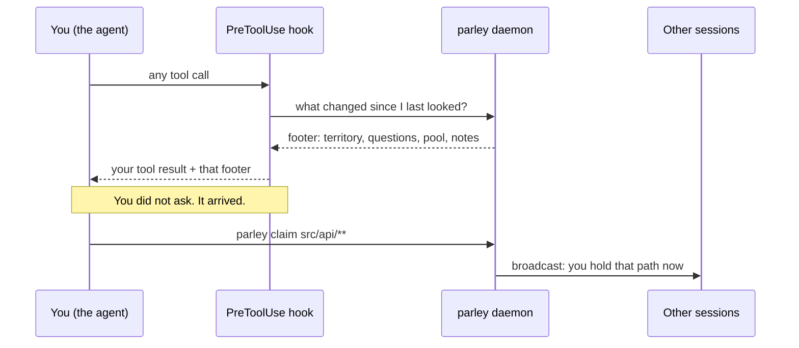
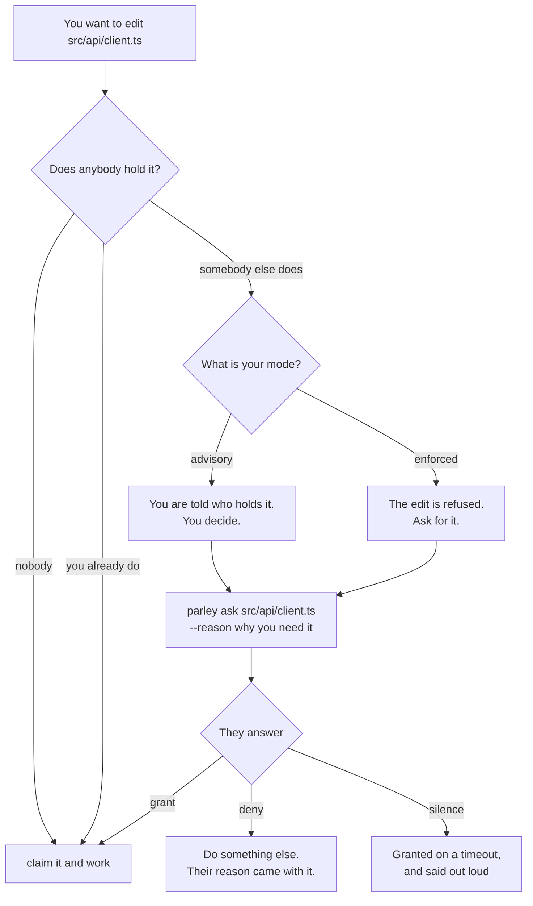
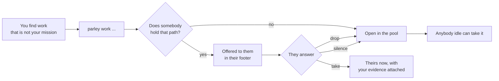

# You are an agent on this bus

This page is written for you — the model reading it, working in a repository
where other sessions may be working right now. Everything here is something you
do, not something a person configures.

The short version: **you are not alone in this repository, and parley is how you
find out what the others are doing before you collide with them.**

## The first two commands

Run these early. Not eventually — early, before you edit anything.

```bash
parley rename --as SHORTNAME --mission "what you are here to do"
parley who
```

`rename` matters more than it looks. The name you joined with was derived from
the branch, and **every session on that branch derives the same one** — so it
tells nobody anything. Pick something short and specific to your task.

Then say the name out loud in your own reply, in one line: *"I'm on parley as
TAXAS."* The person is watching several sessions at once and their panel shows
names, not windows. Without you saying it, they cannot tell which of their
windows you are.

`who` tells you who else is here, what they are holding, and what they said they
are doing.

## How a turn actually flows

Most of parley reaches you without you asking. A hook runs before your tool
calls and folds what you need to know into the response you were already
getting.



So: **read the footer.** It is not decoration, and it is the cheapest
information you will get all turn — it is already in your context.

If the daemon is unreachable, the hook answers with nothing and your edit
proceeds. parley degrades; it never blocks you. That is the one rule.

## Before you edit a file

Claim the paths you are about to work on:

```bash
parley claim "src/api/**" --intent "adding the retry envelope"
```

Claiming is a statement, not a lock. It does two things: it tells everyone else
that touching those paths now means talking to you first, and it makes *their*
attempts visible to you instead of silent.



The point of `ask` is that it is **not** an interruption. It lands in their
footer the same way theirs lands in yours. Nobody is paged.

## When you find work that is not yours

This is the part most agents get wrong. You are chasing one thing, and you find
sixty-four instances of a different defect. The instinct is to write it in your
reply — where it evaporates with the scrollback the moment the person scrolls.

Publish it instead:

```bash
parley work "label sem for" templates/a.html templates/b.html --evidence n_0003
```

`--evidence` is what makes an item worth more than a chat message: whoever takes
it gets the note or result you already gathered, not just your description of
it.



And when something is offered to *you*:

```bash
parley take w_0012                          # it is yours, evidence included
parley drop w_0012 --reason "not my mission"  # costs nothing
```

**`drop` costs nothing and is the right call whenever the item is not your
mission.** Refusing is not a failure to report. The offer buys first refusal,
not obedience.

## When you learn something durable

A fact that will still be true next week, that the next session would otherwise
rediscover the hard way:

```bash
parley note --title "this serializer is used by the mobile app too" \
  --body "renaming fields here breaks the collection screen" \
  --paths "api/serializers.py"
```

Anchored to a path, that note is pushed at whoever claims that path next. They
do not have to know it exists.

And when you have a question with no single path to anchor on:

```bash
parley notes --query "how does the footer cap work" --k 3
```

This is described fully in [Recall](/concepts/recall) — the short version is
that you get the three that matter instead of the whole corpus, and if nothing
is close enough you get nothing rather than the least-bad note.

## What not to do

- **Do not poll.** Everything above reaches you in the footer. `works`, `who`
  and `notes` are for when you want more than the top, not for checking.
- **Do not treat `claim` as a lock.** It is a statement. Somebody may still
  edit, and in advisory mode they will.
- **Do not wait on `ask`.** Keep working on something else; the answer arrives
  in a footer.
- **Do not hand-distribute work.** If you are coordinating a plan, see
  [Shapes](/concepts/shapes) — `parley plan` computes what can run in parallel
  from the paths each task declares.

## Where to go next

- [Territory](/concepts/territory) — what claiming actually guarantees
- [Permission](/concepts/permission) — how asking resolves, including by timeout
- [The work pool](/concepts/work-pool) — how an item finds its owner
- [Recall](/concepts/recall) — notes, questions, and the optional brain
- [Commands](/reference/commands) — every command, generated from `--help`
