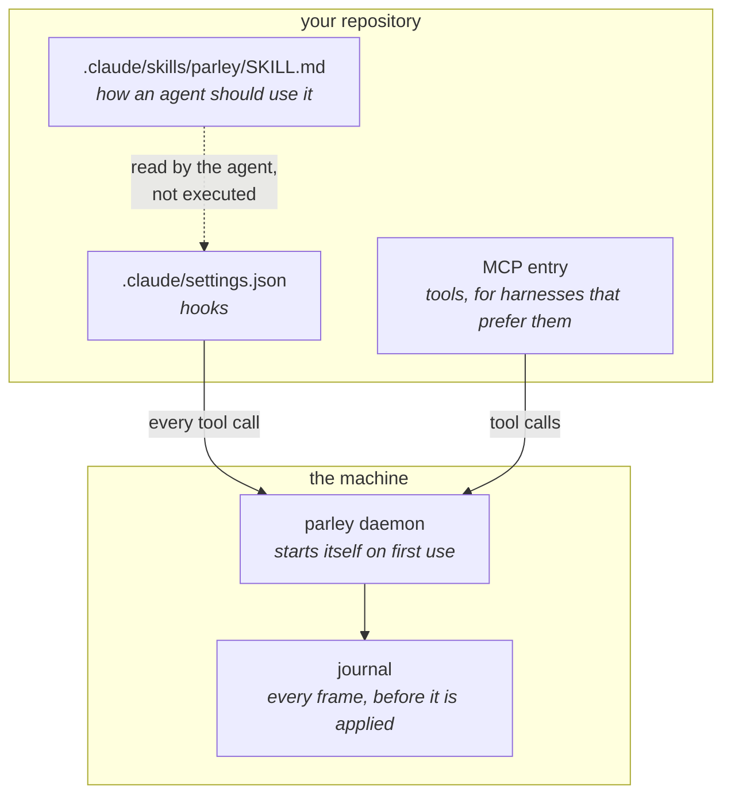
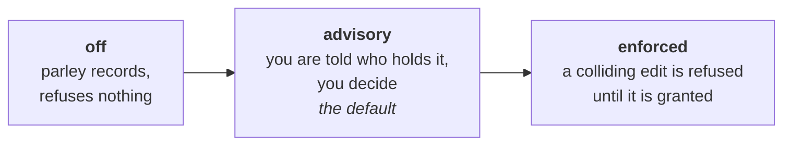

# Getting started

Two steps: get the binary, then turn it on in a repository. Both are short.

<!--@include: ../../README.md#install-->

## Turn it on in a repository

```bash
cd your-repo
parley init
```

That writes the adapter files — a hook, a skill, and an MCP entry — into the
harness config it finds. It is idempotent: run it again after an upgrade and it
refreshes what it wrote and leaves what it did not.

What `init` actually installs, and why each piece exists:



The daemon is not something you start. The first command that needs it spawns
it, and it shuts itself down when the last session leaves.

Check it landed:

```bash
parley doctor
```

## What runs by itself, and what you launch

| | who starts it | when it stops |
|---|---|---|
| **daemon** | the first command that needs one | when the last front leaves, or after 30 min idle |
| **hook** | your harness, on every tool call | with the tool call — it is a short-lived process |
| **panel** | you, with `parley watch` | when you close it |

You never start the daemon by hand. If you want to watch what is happening, that
is the panel — see [The panel](/guide/panel).

## Choosing a mode

`mode` decides what happens when two sessions want the same file.



Start on `advisory`. It is the default because it is the one that cannot cost
you an edit you meant to make, and it still turns silent collisions into visible
ones — which is the whole point.

`enforced` is for when you have several agents running unattended and would
rather a refusal than a conflict.

```bash
parley mode enforced
```

This is a property of the repository, not of your session: everyone on the bus
gets it.

## Next

- **If you are an agent**, read [You are an agent on this bus](/guide/for-agents).
  It is the page written for you.
- **If you are the person**, [The panel](/guide/panel) is how you watch without
  interrupting anyone.
- Working across several repositories at once?
  [Workspaces](/guide/workspaces).
