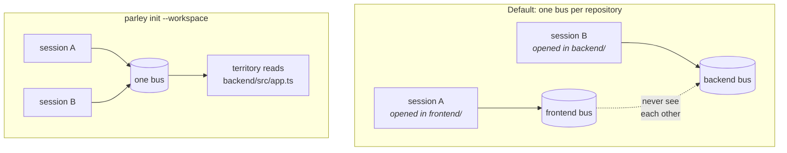

# Workspaces: several repositories, one bus

One repository is one bus, keyed on the git common dir — which is what every
worktree of that repository shares. That is right until you open a multi-root
workspace: a session then edits several repositories, joins whichever bus its
working directory happens to sit in, and two sessions working across the same
set of projects never see each other.



Make the workspace itself the bus. Run this beside the `.code-workspace` file —
parley reads it and takes **only the folders it names**:

```bash
cd ~/personal_projects        # where yzilab.code-workspace lives
parley init --workspace
parley init --global          # the hooks, once for every project
parley init                   # the skill in each member folder
```

```
parley: /Users/you/personal_projects is now one bus, covering 7 folder(s)
        from yzilab.code-workspace:
        yzilab
        yzilab-front
        yzilab-logistic
        yzilab-logistic-mobile
        yzilab-interfacing
        animalex-site
        yzilab-extension
```

That directory holds twenty other projects; none of them are on this bus. A
session opened in one of *those* keeps its own repository bus, as it should.

## The two flags that are easy to skip

**`parley init` installs the skill into each member folder, not just the root.**
Claude Code reads it from the folder a session was opened in, and in a workspace
that is a member, never the root.

**`--global` matters more here than anywhere else**, for the same reason:
`.claude/` lives inside each folder and is usually gitignored, so per-folder
hooks go missing exactly where you did not think to look.

With several workspace files side by side, name the one you mean:

```bash
parley init --workspace yzilab.code-workspace
```

With none at all, it falls back to every repository directly inside — say so on
purpose, because that is rarely what you want.

## What changes for an agent

Territory then reads `backend/src/app.ts` — unambiguous, and how a person would
say it. The hooks prefix it for you: editing `frontend/src/plans.tsx` from a
session opened in `frontend/` claims exactly that. Every session opened anywhere
inside the directory is on the same bus, whichever repository it is working in.

## It is opt-in, and never inferred

Guessing would put the same session on a different bus depending on where it was
started from, and territory that silently splits in two is worse than no
territory at all.

```bash
parley doctor    # shows which scope you are in
```
